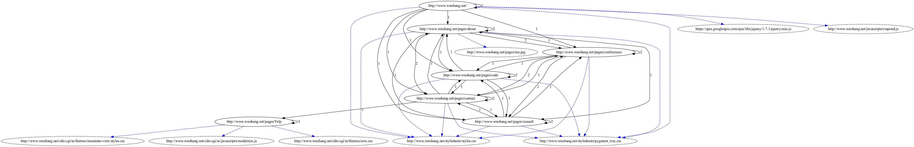

[](https://goreportcard.com/report/github.com/ronin13/dotler)
[](https://travis-ci.org/ronin13/dotler)

# Dotler

## Introduction
Dotler is a web crawler and graph generator. The graph hereforth refers
to a graphviz graph, an internal graph also exists but it is internal.
The crawling and generation are done concurrently. Much like a pipeline,
one goroutine crawls and dispatches it to another which generates the
graph.

It also crawls only within its domain, and 
maintains a map of any static assets from a page.

Generated graph looks like:



Algorithm is as follows:
(Skipping implementation details)

### Main (dotler.go)

1) Get the root url.
2) Send to request Channel.
3) Iterate over request Channel and dispatch urls from it to crawl goroutine until
    i) SIGINT / SIGTERM are sent.
    ii) All the urls in the domain have been crawled and all goroutines are idle.
4) During shutdown, we persist the graphviz to a .dot file, generate SVG if required and show the image as well.

### crawl goroutine (crawler.go)

1) Update a map implementing NodeMapper interface to ensure we don't duplicate process page.
2) Get all links on the page, goquery is used for this purpose.
    i) Unless the link is already processed, send it to request Channel if it is part of same domain.
    ii) Update this pages map of static assets and links originating from this page.
    iii) Follow HTML tags are considered:
        a) a, img, script, link, source
            - for attributes: href, src

3) After a page is successfully processed, send it over to dotprinter goroutine over a separate channel.

### dotprinter goroutine (printer.go)

1) Get new page from channel.
2) Generate new graphviz node and outlinks and links to static assets, creating new nodes if necessary.

### General implementation details.

1) Channels are used for communication between crawling goroutines (which are many and capped at MAXWORKERS at a time), dotprinter (which is one) and main function.
    - Also used for signalling shutdown and completion of work and with contexts.
2) Contexts with Cancel are used to cancel, timeout channels and timeouts are also used wherever necessary.
3) Each crawling goroutine itself uses a timeout - crawlThreshold - if a page is taking too long.
4) Statistics are printed during shutdown.
5) A signal handler (for shutdown) sends signal on termChannel which does cleanup, persist graph among other things.
6) Each page is tried maxFetchFail (default 2) times in case of failure.
7) Wait groups are used to wait on goroutines

### Core data structure

```
type Page struct {
	statList  map[string]StatPage
	outLinks  map[string]*PageWithCard
	PageURL   *url.URL
	failCount uint
}
```


This is the structure passed around in channels for request and graph processing.

1) statList is a map of static assets from this page.
2) outLinks is a map of Page links from this page. PageWithCard is a struct with cardinality of links to it.
3) PageURL is the url of the page.
4) failCount is the number of times this page crawling can fail.

## Races
Every attempt has been made to eliminate race conditions.

```
make race 
```

builds with race detector.

## Example

### Generating image.

(Image generation is off by default, only '.dot' is generated by default, hence the need to pass '-gen-image')

```
./dotler  -idle 15 -gen-image
I0123 09:40:58.225472   22242 dotler.go:140] Starting crawl for http://www.wnohang.net/ at 2017-01-23 09:40:58.225382422 +0000 UTC
I0123 09:40:58.225587   22242 crawl.go:162] Processing page http://www.wnohang.net/
I0123 09:40:58.225474   22242 printer.go:46] Starting the dot printer!
I0123 09:40:58.291682   22242 crawl.go:162] Processing page http://www.wnohang.net/pages/conferences
I0123 09:40:58.291832   22242 crawl.go:162] Processing page http://www.wnohang.net/pages/about
I0123 09:40:58.292328   22242 crawl.go:162] Processing page http://www.wnohang.net/pages/consult
I0123 09:40:58.292576   22242 crawl.go:185] Successfully crawled http://www.wnohang.net/
I0123 09:40:58.292588   22242 crawl.go:162] Processing page http://www.wnohang.net/pages/code
I0123 09:40:58.292821   22242 crawl.go:162] Processing page http://www.wnohang.net/pages/contact
I0123 09:40:58.478473   22242 crawl.go:185] Successfully crawled http://www.wnohang.net/pages/about
I0123 09:40:58.492634   22242 crawl.go:185] Successfully crawled http://www.wnohang.net/pages/conferences
I0123 09:40:58.541920   22242 crawl.go:185] Successfully crawled http://www.wnohang.net/pages/code
I0123 09:40:58.547295   22242 crawl.go:185] Successfully crawled http://www.wnohang.net/pages/consult
I0123 09:40:58.550896   22242 crawl.go:162] Processing page http://www.wnohang.net/pages/Yelp
I0123 09:40:58.551478   22242 crawl.go:185] Successfully crawled http://www.wnohang.net/pages/contact
I0123 09:40:58.646226   22242 crawl.go:185] Successfully crawled http://www.wnohang.net/pages/Yelp
I0123 09:41:13.551083   22242 dotler.go:148] Idle timeout reached, bye!
I0123 09:41:13.551282   22242 dotler.go:160] Crawling http://www.wnohang.net/ took 0 seconds
I0123 09:41:13.553769   22242 dotler.go:166] We are done, phew!, persisting graph to dotler.dot
I0123 09:41:13.553788   22242 dotler.go:67] Crawl statistics
I0123 09:41:13.553793   22242 dotler.go:68] ===========================================
I0123 09:41:13.553796   22242 dotler.go:72] Successfully crawled URLs 7
I0123 09:41:13.553800   22242 dotler.go:75] Skipped URLs 0
I0123 09:41:13.553802   22242 dotler.go:78] Failed URLs 0
I0123 09:41:13.553805   22242 dotler.go:81] Cancelled URLs 0
I0123 09:41:13.553808   22242 dotler.go:83] ===========================================
I0123 09:41:13.553811   22242 postprocess.go:20] Generating svg from dot file

```

Note: For testing and other reasons, one can also fully turn off graph generation with `-gen-graph=false`.

### Showing image

```
./dotler  -max-crawl 30 -gen-image -image-prog='chromium'
```

### With url

```
./dotler -url 'https://blog.wnohang.net'  -idle 10
./dotler  -max-crawl 30  -url 'http://blog.golang.org'
```

### Example execution with complete log for a larger site.

[Link to Gist](https://gist.github.com/ronin13/b407b3ee49c36532deb694bca66ed718)

#### Note
The SVGs generated have clickable graph nodes.


## Testing

```
make test
golint *.go
go vet *.go
go build -v -o dotler
dotler/vendor/golang.org/x/net/html/atom
dotler/vendor/github.com/PuerkitoBio/urlesc
dotler/vendor/golang.org/x/net/idna
dotler/vendor/golang.org/x/text/transform
dotler/vendor/golang.org/x/net/html
dotler/vendor/github.com/awalterschulze/gographviz/token
dotler/vendor/github.com/golang/glog
dotler/vendor/github.com/awalterschulze/gographviz/ast
dotler/vendor/golang.org/x/text/unicode/norm
dotler/vendor/golang.org/x/text/width
dotler/vendor/github.com/awalterschulze/gographviz/scanner
dotler/vendor/github.com/awalterschulze/gographviz/parser
dotler/vendor/github.com/andybalholm/cascadia
dotler/vendor/github.com/PuerkitoBio/purell
dotler/vendor/github.com/PuerkitoBio/goquery
dotler/vendor/github.com/awalterschulze/gographviz
dotler
go test -v .
=== RUN   TestDotlerCrawl
--- PASS: TestDotlerCrawl (0.61s)
=== RUN   TestDotler
--- PASS: TestDotler (27.80s)
PASS
ok      dotler  28.415s
```

## Benchmarking

```
make bench
golint *.go
go vet *.go
go build -v -o dotler
dotler/vendor/golang.org/x/net/html/atom
dotler/vendor/github.com/PuerkitoBio/urlesc
dotler/vendor/golang.org/x/net/idna
dotler/vendor/golang.org/x/text/transform
dotler/vendor/golang.org/x/net/html
dotler/vendor/github.com/awalterschulze/gographviz/token
dotler/vendor/github.com/golang/glog
dotler/vendor/github.com/awalterschulze/gographviz/ast
dotler/vendor/golang.org/x/text/unicode/norm
dotler/vendor/golang.org/x/text/width
dotler/vendor/github.com/awalterschulze/gographviz/scanner
dotler/vendor/github.com/awalterschulze/gographviz/parser
dotler/vendor/github.com/andybalholm/cascadia
dotler/vendor/github.com/PuerkitoBio/purell
dotler/vendor/github.com/PuerkitoBio/goquery
dotler/vendor/github.com/awalterschulze/gographviz
dotler
go test -v -run=XXX -bench=. -benchtime=60s
BenchmarkCrawl-4                    5000          34908232 ns/op
BenchmarkDotler-4                    100        1014623383 ns/op
BenchmarkDotlerWithoutGen-4          100        1035630444 ns/op
PASS
ok      dotler  384.414s
```

## Static analysis

```
make analyse
```

## Build 

```
make dotler
```

## Sample SVG
A sample svg generated is present as wnohang.svg. The numbers of edges is link cardinality (number of links from one page to another).
Blue dotted line is to link to static assets (dashed)
Nodes themselves are oval with URL inside them. They can be clicked upon to lead to the actual page.

It is also attached to the PDF for quick view.


## How fast is this aka Performance!
- It runs quite fast. :)

- In the logs, look for a line like:
 " Crawling http://XXXXX took 8 seconds "

- Note that this is only the crawling time excluding any post processing time to persist the graph, generate SVG or show the image.

- Benchmarks (from make bench) include the entire time.

## Credits
-  https://github.com/PuerkitoBio/goquery 
-  https://github.com/PuerkitoBio/purell
-  https://github.com/golang/glog
-  https://github.com/Masterminds/glide
-  https://github.com/awalterschulze/gographviz

